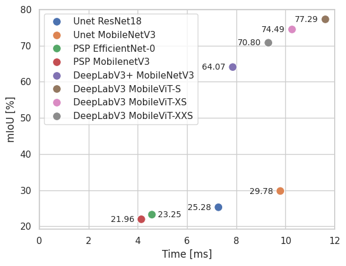
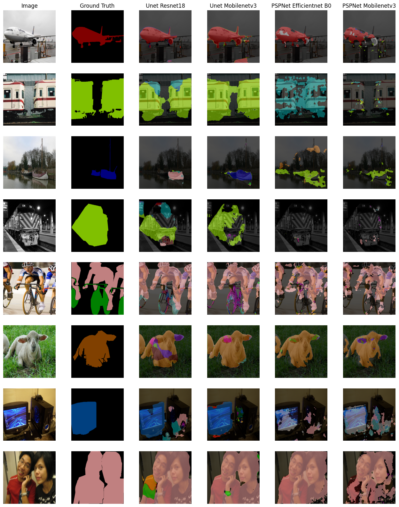
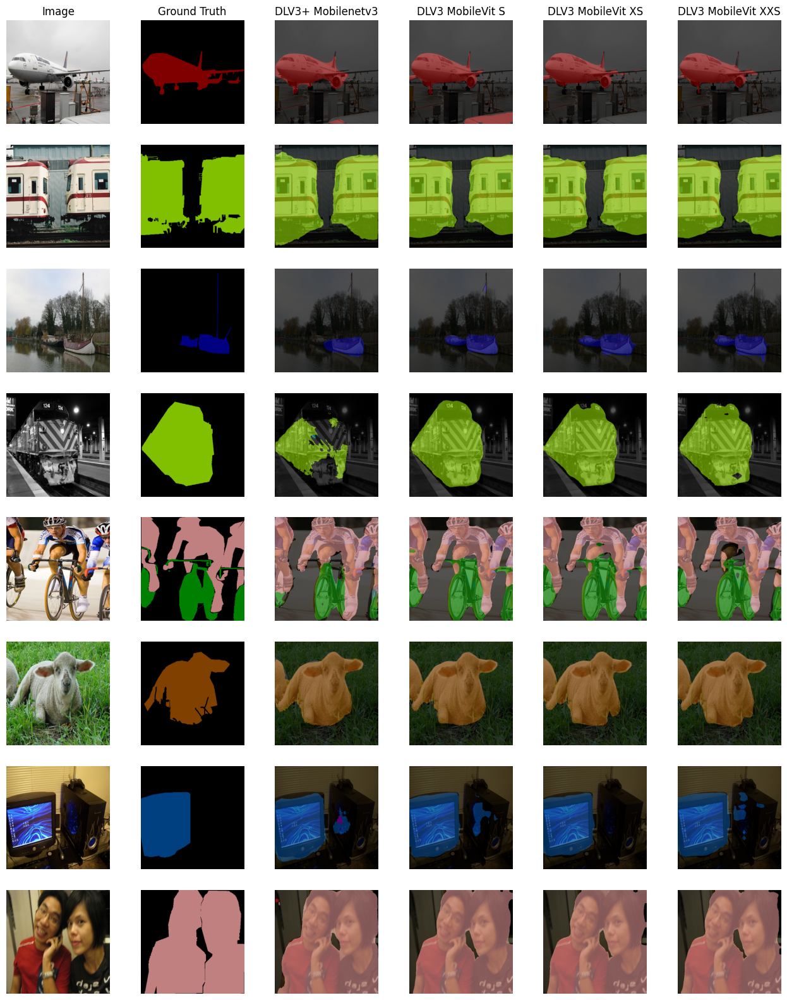

# Comparison of fast segmentation models

This projects aim to fine-tune and compare segmentation models based on PASCAL VOC database. Models vary from U-Net like architekture to ViT base models. This project uses [Segmentation Models Pytorch](https://github.com/qubvel-org/segmentation_models.pytorch) (SMP) library and HuggingFace as sources for models.

## Models
##### Models from SMP:
* U-net architekture
    * ResNet18
    * MobileNetV3
* PSPNet with backbones
    * EfficientNet-0
    * MobileNetV3
* DeepLabV3+ with backbone
    * MobileNetV3

##### Models from Hugging Face
* DeepLabV3 with backbones
    * MobileVit-S
    * MobileVit-XS
    * MobileVit-XXS

## Method
#### Training
Models from **SMP** where pretrained on ImageNet and fine-tuned to PASCAL VOC dataset on simple GPU with following configuration:
* Image size $512 \times 512$
* Batch size $16$
* Trained on 100 with patience set to 10 epochs
* Learning rate $1e^{-5}$

Models from **Hugging Face** where already trained on PASCAL VOC dataset with return mask size $32 \times 32$. To increse mask size to $512 \times 512$ bilinear interpolation was added as additional step to model output.

#### Quantization
Models were quantized to `ONNX` format and tested on single mobile device (smartphone with Dimensity 7200-Ultra processor).

## Results
#### GPU
Results achived on single GPU with batch size 1.

| Model | Backbone | mIoU [\%] | Inference time [ms] | Size [MB] |
| ----- | -------- | :-------: | :-----------------: | :-------: |
| U-Net | ResNet18 | 25.28 | 7.27 | 168  |
| U-Net | MobileNetV3 | 29.77 | 9.79 | 78  |
| PSPNet | EfficientNet-0 | 23.25 | 4.57 | 18  | 
| PSPNet | MobileNetV3 | 21.96 | 4.14 | 14  |
| DeepLabV3+ | MobileNetV3 | 64.07 | 7.85 | 56  | 
| DeepLabV3 | MobileViT-S | 77.29 | 11.61 | 26  | 
| DeepLabV3 | MobileViT-XS | 74.49 | 10.26 | 12  | 
| DeepLabV3 | MobileViT-XXS | 70.80 | 9.30 | 8  | 

#### Mobile
Results achieved on mobile phone with batch size 1.

| Model | Backbone | mIoU [\%] | Inference time [ms] | Size [MB] |
| ----- | -------- | :-------: | :-----------------: | :-------: |
| U-Net | ResNet18 | 40.36 | 1171 | 56  |
| U-Net | MobileNetV3 | 40.55 | 887 | 26  |
| DeepLabV3+ | MobileNetV3 | 69.68 | 439 | 18 | 
| DeepLabV3 | MobileViT-S | 69.92 | 1168 | 26 | 
| DeepLabV3 | MobileViT-XS | 67.60 | 815 | 12 | 
| DeepLabV3 | MobileViT-XXS | 66.31 | 663 | 8 | 

#### Examples

